You won't BELIEVE what's #1 (it's Monster Hunter, duh)

<!-- truncate -->

I've been making a list of my top 10 games every year since 2019, but I haven't ever written up my thoughts on them. It's mostly for my own benefit since I have the memory of a goldfish, though I usually wound up posting on Twitter towards the end of December.

But my Twitter account is long gone now and I don't use Bluesky all that much, so I figured I'd make a blog and take a stab at some longer form writing for the first time in a decade.

If you're just interested in the list, the right sidebar should show all of them, and you can jump to my thoughts on specific games by clicking them there.

## Top 10 games

To be clear, these are my top 10 games I _played_ and that _released_ in 2025. There are definitely some older games I loved that would've knocked a few off the list, as well as some that I didn't get around to buying/playing.

So without further ado...

### 10: Mario Kart World

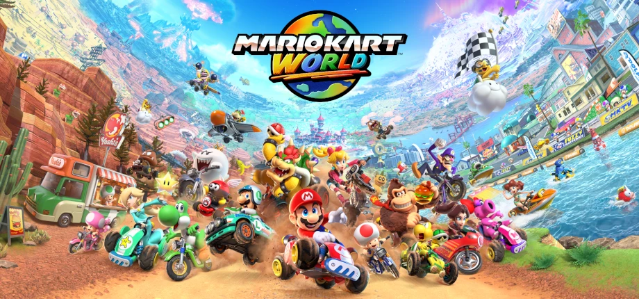

If Mario Kart World wasn't the singular first party Switch 2 launch title, I'm not sure I would've picked it up. Maybe if I was a more competitive person I'd get more mileage out of it playing online, or if I had more space than my tiny apartment offers I'd get more enjoyment out of inviting friends over for split-screen multiplayer, but as it stands I don't feel like I got much value out of it.

That's not to say it's a bad game - it's as fun as Mario Kart's ever been, and downright gorgeous. Seriously, it's almost unbelievable that a game running on such a tiny device looks _this_ good on a 4K TV. It often left me with a similar sense of awe as when I played Ratchet & Clank: Rift Apart on PS5; it's downright mind-blowing that video games now look _better_ than the 3D animated movies I grew up with. And they're interactive!

The moment-to-moment racing is unsurprisingly excellent, but the open world unfortunately feels like an unnecessary gimmick. Far too many tracks are point-to-point routes that don't involve racing laps, and the driving start to races after the first in each grand prix doesn't feel particularly good. The open world itself is also pretty empty and it's baffling that the world map is completely useless, not even marking the locations of any of the P-Switch challenges.

I spent around 10 hours on it racing through each of the grand prix at 150cc, unlocking all the characters/outfits, and did a bit of multiplayer with a friend one (1) time. Haven't played it since. Fun game, but not remotely the generation-defining launch title Breath of the Wild was.

### 9: Absolum

This might have ended up higher on the list, but I haven't put quite as much time into it as I would've liked - I've only done 4 or 5 runs, with my longest taking me to the boss of the third region.

I should probably explain what the game is, shouldn't I?

Absolum is a roguelite beat 'em up from the developers of Streets of Rage 4. It's set in a wonderfully realised fantasy world, has gorgeous hand-drawn art, top-notch gameplay, and the roguelite elements elevate the experience instead of feeling tacked-on. Honestly, I'm a bit surprised nobody's made a roguelite beat 'em up before now - the combination feels as ideal as when Slay the Spire did the same for deckbuilders.

It definitely takes a lot of pointers from Hades - while it doesn't involve quite as much dialogue and NPC interaction as Hades, there is some in (and between) each run, as well as lore that fleshes out the world. Something I really appreciated are the side quests; some are small tasks that you can complete in the same run, some unlock additional paths for future runs, and some involve chipping away at an objective on a certain path over multiple runs. These really spice up run variety, and it helps a lot that you can see these quests on the map when choosing which path to take.

I initially discovered Absolum [on TikTok](https://www.tiktok.com/@mick.gordon/video/7556698571769253137) and the clip is still my favourite part of the game - Mick Gordon does the music for the first major boss fight, somehow combining cartoon horns and guitars tuned lower than one would think possible to make easily my favourite bit of video game music this year.

### 8: DOOM: The Dark Ages

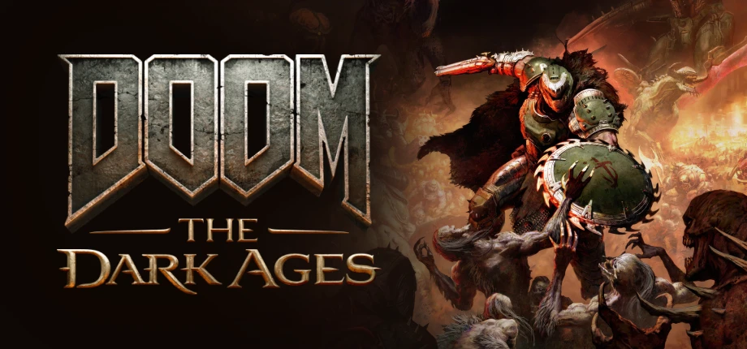

It took around an hour of playing DOOM Eternal to discover the game wasn't for me, and 5 minutes of The Dark Ages to realise it absolutely is.

I imagine most who enjoyed Eternal had the opposite experience, but I love that id Software have been willing to take such wildly different swings at FPS gameplay with each of the modern DOOM games because this third entry is easily my favourite of the bunch.

Where Eternal felt like speed chess, with every encounter requiring you to be firing on all cylinders to manage cooldowns and constantly be switching to the correct tool for each enemy, The Dark Ages is simply _crunchy_.

Every shot, every melee blow, every shield parry makes you feel like an absolute badass, and having a smaller toolkit that gives you the freedom to tackle most enemies however you want makes it a blast. Especially when that toolkit includes a gun that shoots crushed up demon skulls and a railgun that shoots a massive steel ball on a chain. Genuinely some of the coolest shit I've ever seen.

As someone who's never really cared for difficulty, I also really appreciated how much you could tailor the experience to your preferences. Instead of just the standard difficulty options, the game offers sliders for parry window, incoming damage, outgoing damage, enemy aggression, overall game speed, and even a resource value multiplier.

Challenge simply isn't something I personally value; while I can appreciate a game despite the difficulty (I have the platinum trophy for Elden Ring), this just works so much better for me. I consider Dragon Age: The Veilguard, this, and Ghost of Yōtei later in this list the gold standard for customisable difficulty, and I hope more games take notes from them.

One last thing I want to mention is that I haven't actually finished The Dark Ages. I subscribed to Game Pass in May to play it & Expedition 33 and didn't get around to completing either; I was planning on subscribing again over my December holiday to finish them off, but the 150% price increase to Game Pass Ultimate, among other gross Microsoft decisions this year, left a sour taste in my mouth. I only use my Series X for F2P games now, and I'll likely buy The Dark Ages on PS5 sometime next year when it inevitably goes on sale.

### 7: Deadzone: Rogue

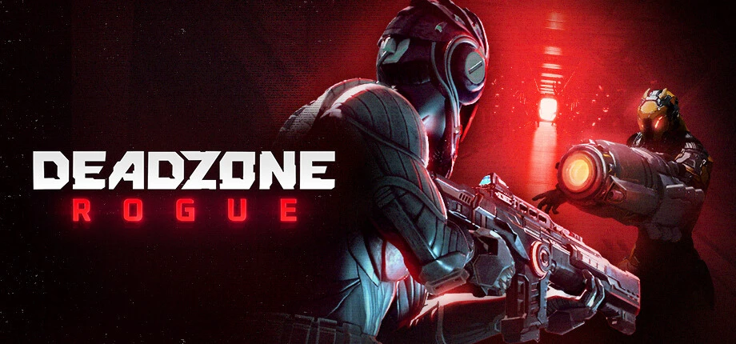

I've been looking for a fun FPS to hop into whenever I'm in the mood to shoot some dudes since I stopped playing Destiny 2 last year, and Deadzone: Rogue has been my drug of choice for the last few months.

It's a roguelite FPS with extremely satisfying gunplay and fantastic build variety, which is more or less all one could ask of a roguelite FPS.

The only things I can really knock it for are the level design being uninspired (most of the rooms feel exactly the same) and that I wish there was a bit more verticality to the movement, though the latter is probably just me missing Destiny 2.

I liked Deadzone: Rogue enough to buy it a second time when it released on console in September, which should probably say enough. Highly recommend this to anyone that enjoys shooting robots and/or aliens.

### 6: Borderlands 4

Third FPS in a row!

Borderlands 4 is peak Borderlands. While Borderlands 3 improved the gunplay massively (Have you tried going back and playing Borderlands 2? Its shooting has aged _so_ badly), it was an absolute slog to get through with the grating antagonists insisting on talking to you _constantly_, among other terrible story decisions.

I'm not gonna pretend Borderlands 4's story is anywhere near as good as the second entry, but its villains are a big improvement over 3 and the game manages to hit a much better ratio of comedy to seriousness. Helps that the jokes land far more often than they miss this time too.

The gunplay itself is more or less the same as its predecessor (as in very good) and the new mobility options make both combat and getting around the open world a joy, especially once you're able to upgrade the gliding. I played a bit of Borderlands 3 the week before 4 released and immediately noticed how much better movement feels with the addition of grappling, dodging, and gliding.

This is also easily the best batch of playable characters the series has ever had; with previous entries I knew which vault hunter I wanted to play well before going in and had little interest in the others, but this time I actually struggled to choose with how well designed they all are, especially considering the wonderfully varied buildcrafting opportunities in all of their skill trees.

I eventually landed on Vex for my first playthrough but I fully intend on trying all four eventually, though I'm waiting to see if they improve the alt character experience as it's currently a bit of a pain having to go around the entire open world again.

Other than some nasty technical issues (the PS5 version had a memory leak at launch that caused abysmal framerates after around an hour of playing until you restarted the game) Borderlands 4 really impressed me, and I'm looking forward to playing more of it next year.

### 5: Pokémon Legends: Z-A

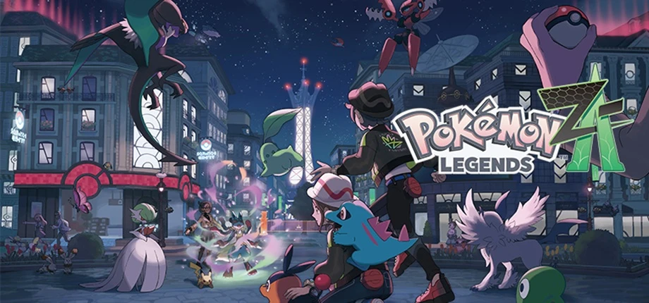

This was a surprise late addition to the list; I had a leftover Nintendo Switch Game Voucher I needed to use in the next few months, and I decided to pick it up on Christmas Eve after being a bit disappointed with Pokémon Violet earlier this year for a reason I'm fully aware is real dumb: no clothing customisation.

Yup, I mostly bought Legends: Z-A because I specifically looked up if it had better clothing options and discovered it did.

I was never all that into Pokémon growing up; I'd seen a few episodes of the anime but never played the games until Pokémon Shield on the Switch, which I liked well enough. I didn't feel it was anything to write home about though.

Imagine my surprise when I ended up _loving_ Legends Z-A.

The real-time combat is so much more fun as a casual player - there's a reason to use more than just your one strongest skill over and over again, and having to consider positioning for both you and your Pokémon only adds to the experience. This is especially apparent in the rogue mega evolved Pokémon fights; these feel almost like single player MMO raids, and there's a very real possibility you (as in the trainer, not your Pokémon) will get knocked out if you're not paying attention.

I haven't quite made it to the end yet, but I've had a truly wonderful time playing this game. The only criticism I have for it is that it sure would be nice if the biggest media franchise in the world would consider adding voice acting for once.

Wild ask, I know.

### 4: Hades 2

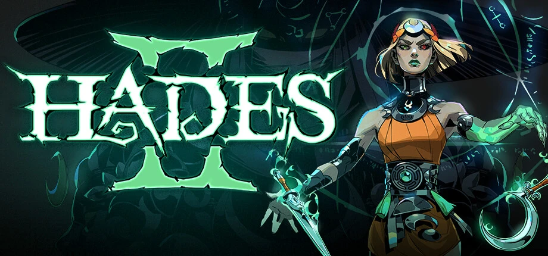

For some reason, I thought I wasn't going to like Hades 2.

I bought it in Early Access when I got my ROG Ally in May 2024 and did around 2-3 runs, then another 2-3 runs when 1.0 released in September. Something felt off about it compared to the first game (which I adored) and September had far too many other games that made it to this list, so I wound up dropping it.

December came around and it was discounted on Switch 2 for the first time, so I decided to double dip and give it fair shake. Boy am I glad I did, because Hades 2 is _fantastic_.

It doesn't put its strongest foot forward, with the gameplay being similar to Hades but different enough that it feels _off_ at first, and everything seeming strangely limited. But as you continue playing you just keep unlocking more and more things that open the game up further, make it feel better. And it doesn't stop. I'm 15 hours in and still finding entirely new mechanics in almost every run.

After a while there's _always_ a new objective you can work towards, helping you decide which of the many paths to take throughout your run. Do you choose the route that offers rewards that'll increase your odds of beating the current run, or resources for meta upgrades that'll make future runs easier? The game seemingly never stops asking you to make interesting gameplay decisions like this.

Hell, once you've made it far enough you get an even bigger decision at the beginning of each run: which of the two entirely separate routes to take, with each having its own set of 4 regions.

I cannot emphasise enough how much bigger than its predecessor Hades 2 is; the scope is honestly staggering.

The gameplay also starts to feel better as you unlock more options and learn to accept that Melinoë isn't Zagreus, and that combat needs to be tackled quite differently to the first game. After unlocking all the weapons I realised the witch's staff you start the game with, which I really didn't like at first, is actually my favourite now that I understand how Hades 2 wants to be played.

Man, what a game.

I've only had a few successful runs of the initial path and one of the other; I'm not sure what's required to reach the "real" ending this time around yet, but I'll definitely be finding out.

### 3: BALL x PIT

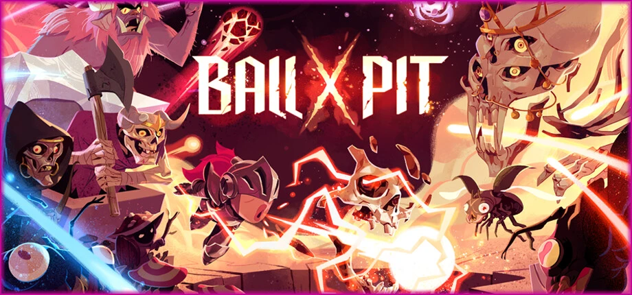

The fourth roguelite on this list.

2025 has been an incredible year for the genre, and all four of my favourites released within a month of each other, give or take, respecting nobody's wallet or free time.

BALL x PIT is a shockingly simple game: it's essentially Breakout/Brick Breaker as a roguelite, with meta progression that combines city building with Tetris. Basically, you shoot balls to bounce between enemies until you beat the level or get overwhelmed, then head back to build up your town to unlock new goodies.

The in-run progression is sublime; you combine two special balls into a new ball that (usually) has the properties of both balls then combine _that_ ball with another, either making a new entirely unique ball, or one that combines the properties of its parts in interesting ways.

For example, one of my favourites is starting off by combining the Bleed and Iron balls to create Hemorrhage, which both applies bleeding to enemies it hits and deals significant damage to bleeding enemies. Then I combine Iron and Lightning to create Lightning Rod, which strikes all nearby enemies with lightning on hit. Finally I combine Hemmorrhage with Lightning Rod, which makes those lightning strikes also apply bleed, turning a mostly single single target ball into one that _also_ does its damage in an AoE.

The possibilties feel endless, and I even enjoy that you can ruin a strong ball if you don't think things through. I distinctly remember a run where I was relying on a ball that did most of its damage by repeatedly bouncing between enemies, then picking an upgrade that made all balls pass through enemies; it absolutely cratered my damage, and I very quickly lost the run. I couldn't help but laugh and accept it as a lesson learned.

And I've barely even mentioned the city builder town progression - figuring out the best way to fit all your unlocked buildings while still maintaining enough space for resource tiles to bounce your workers off to collect is far more satisfying than it is to describe.

I believe the game still has [a demo available on Steam](https://store.steampowered.com/app/3651790/BALL_x_PIT_Demo/). Give it a shot, you might love it as much as I did.

### 2: Ghost of Yōtei

I spent quite a bit of time agonising over whether I wanted to buy Ghost of Yōtei or not.

When Ghost of Tsushima: Legends was given out as PS+ monthly game, I was surprised by how much I enjoyed it - what I'd assumed was a tacked-on co-op mode turned out to have combat that was actually a lot of fun, progression systems that were well thought out, and _immaculate_ vibes.

Given how much I enjoyed Legends I decided to give Ghost of Tsushima proper a go shortly after, but unfortunately fell off it fairly quickly. While it still had the combat and vibes, the open world structure was dreadfully boring, and I was definitely suffering from open world fatigue at the time.

Despite not really liking its predecessor, I'd been somewhat looking forward to Ghost of Yōtei primarily because the main character is played by Erika Ishii, who I _love_ from watching [Dropout](https://www.dropout.tv/), and around a week before my birthday I found myself not in the mood to play any of the games in my library, so I picked it up as an early birthday gift to myself.

I couldn't put it down.

Sucker Punch clearly took the criticism of Tsushima's stock-standard open world to heart; Yōtei has been the most enjoyable open world I've had the pleasure of exploring since Elden Ring and Breath of the Wild.

The way you progress the story at the beginning of the game is nothing short of genius; you have a fairly vague objective of going after 3 targets, and as you explore the world these objectives get fleshed out. You might run into a group of travelling merchants who provide you with a nugget of information for one of the targets, or you might squeeze the information out of the last of group of hostile soldiers that attack you in exchange for letting them live. Sometimes a friendly face shows up at your camp to help you out, or the owner of an inn might have something to point you in one of the many directions you can choose to take.

All of this feels organic in a way I've never really experienced in a story-focused game before; it left me wondering how the developers managed to pull it off. Does almost every NPC you meet early on have the possibility of providing all of the bits of direction you need, but only ever gives one per playthrough? The world is fairly open from the beginning so there's no way to guarantee a player will meet some of these NPCs, meaning there has to be multiple ways the objectives are fed to you.

I wouldn't say the story is the best the medium has to offer, but it's compelling enough and all of the main characters are incredibly well voiced and acted. Ishii's Atsu is incredible, but some of the others (which I won't name to avoid spoilers) provide truly stellar performances as well.

The only issue I have with Yōtei is that it's far too long - I unfortunately burned out at around the 50 hour mark and haven't been able to get back to it yet. I'm sure the length isn't an issue for most people though; this happens to me fairly often 40-50 hours into single player games, and I fully intend to get back to it once my dumb brain allows me to.

### 1: Monster Hunter Wilds

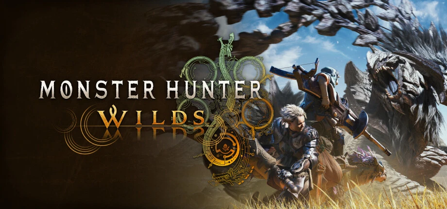

Finally, the least surprising game to top this list for anyone that knows me.

I've been obsessed with Monster Hunter since Monster Hunter World's pre-release demo on PS4. I've bought and played through it on PS4, PC, and Xbox. I've played through the Iceborne expansion on Xbox and PS5 (my ageing PC couldn't handle the expansion areas). I've bought and played through Monster Hunter Rise and its Sunbreak expansion on Switch, PC, and PS5.

I fuckin' love Monster Hunter, man.

And Monster Hunter Wilds is peak Monster Hunter.

It's held back a bit by technical issues and streamlining the Monster Hunter gameplay loop a bit _too_ much, but I've had the time of my life with it.

All of my favourite weapons feel better than ever (though I miss Rise's blast dash on gunlance) and the buildcrafting possibilities tickle my autism in just the right way, as every Monster Hunter game I've played has.

I even put the effort into grinding out the platinum trophy for it, spending an unhealthy amount of time hunting for miniature and gold crown monsters while trading and coordinating crown hunts with other players on one of the big Monster Hunter Discord servers.

Wilds released in February and I already knew back than that it would be at the top of this list. It might not be the game I've played the _most_ this year (that honor goes to Warframe) but goddamn did I play a lot of it, and had a good time to boot.

The expansion should be releasing next year and I can tell you now that it's gonna be my top game of 2026. Expansions count! It's my list and I get to decide.

---

## Honorable mentions

A couple other games I played this year that deserve a shoutout, even if they didn't make my top 10.

### Clair Obscur: Expedition 33

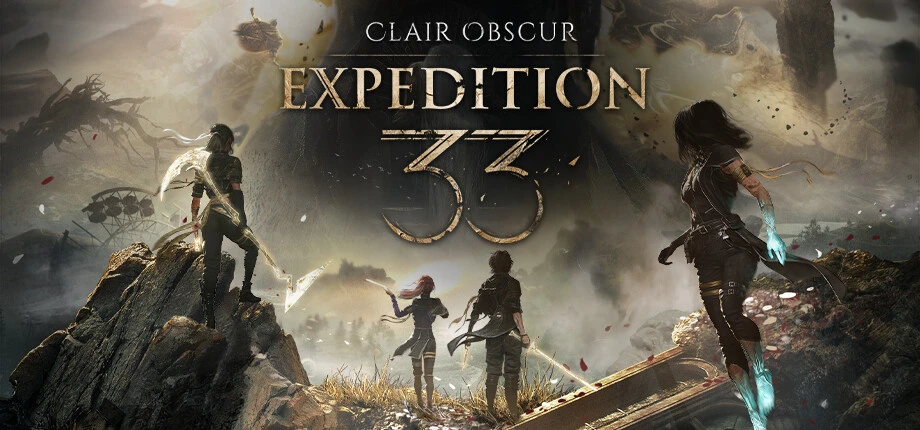

Unfortunately Expedition 33's gameplay isn't for me, and I'm the type of person who can enjoy a game with bad story if the gameplay kicks ass but not the other way around. The story and wonderfully realised characters are clearly some of the best video games have to offer, but I only made it to around halfway through Act 2 before dropping the game. I'd like to get back to it at some point, though I'll likely need to buy it again and start over on PS5 since I played it on Game Pass and have no intention of resubscribing.

### Fantasy Life i: The Girl Who Steals Time

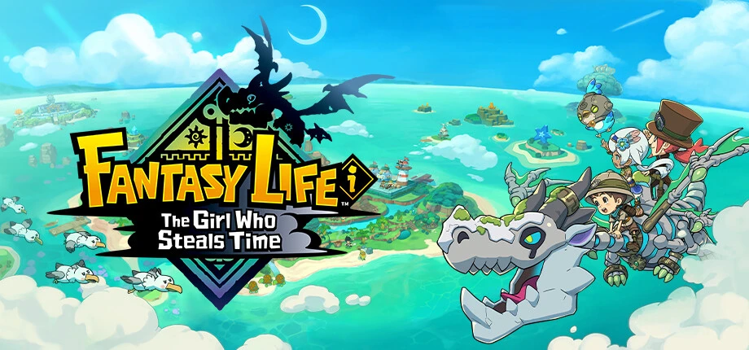

Fantasy Life i started out _so_ strong. A great class system that reminded me of FFXIV, fun combat/gathering/crafting, and a silly low-stakes (and often actually funny!) story. Then around 10 hours in it basically turned into an Animal Crossing clone; suddenly you're in charge of an island that you need to clear up and build houses for NPCs on that seems to be intrinsicly woven into most of the gameplay going forward. I immediately checked out. Maybe one day I'll get back to it when/if I'm ever in the mood for that type of game again, but for now it's shelved.

### Peak

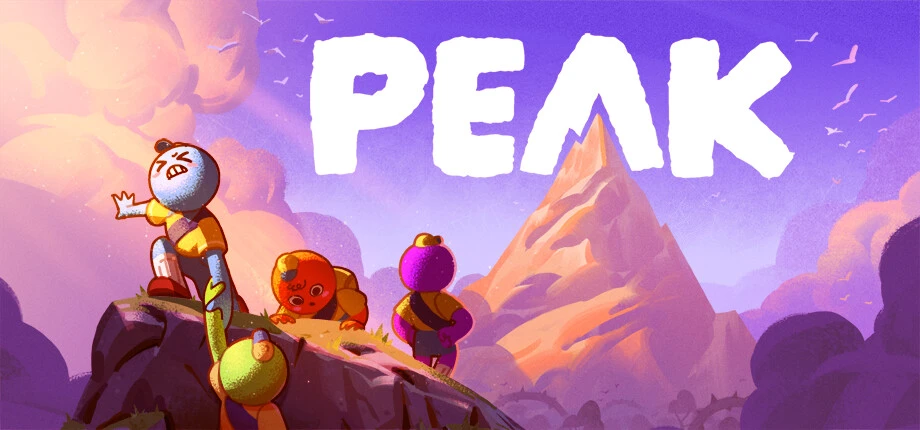

This game was very fun for the 3 days my friends played it. I'm really glad Landfall and Aggro Crab went viral with it - both studios deserve it and I'm looking forward to what they put out in the future now that I imagine they have pretty good safety nets (instead of every game being make-or-break as it often is for indie studios) thanks to Peak's success.

### Haste

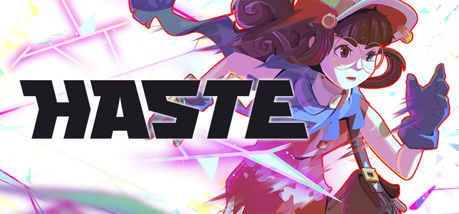

Speaking of Landfall and playing for 3 days, Haste is a very cool game that I didn't put nearly enough time into. The core gameplay is very fun, but it doesn't run all that well on my ROG Ally so I've only played for around 2 hours. Maybe one day I'll play it once I've built a new PC.

---

## Missed games

These are the games I was interested in this year but didn't get around to buying and/or playing:

- Donkey Kong Bananza
- Ender Magnolia: Bloom in the Mist
- Two Point Museum
- Wanderstop
- Avowed
- Eternal Strands
- The Hundred Line -Last Defense Academy-

---

This ended up being a _lot_ longer than I expected, sheesh. I was actually planning to include my favourite older releases I played this year but this post is already far too long and I definitely don't have the energy for it right now.

Maybe I'll do a post for it in the new year? I didn't actually have plans for this blog beyond this post so having at least one (1) more idea in the pipeline is probably a good thing.

Anyway, I've rambled on long enough.

Until next time, 👋.
